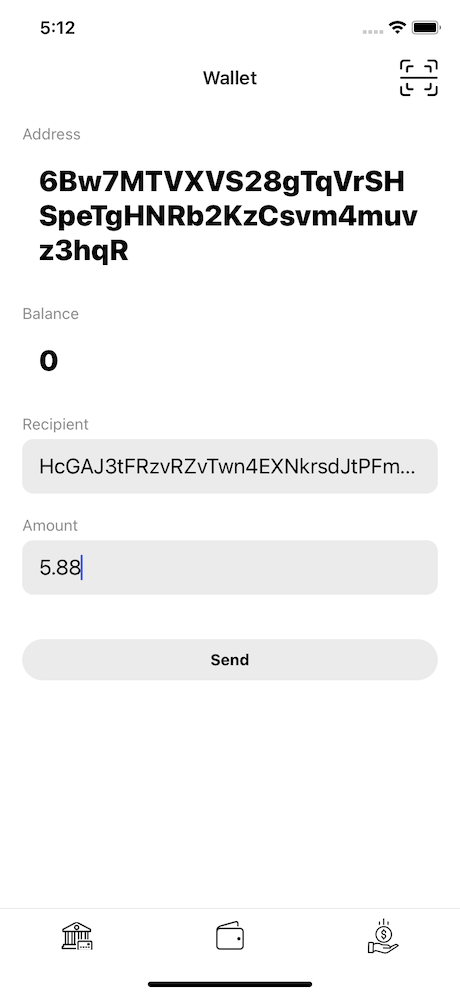
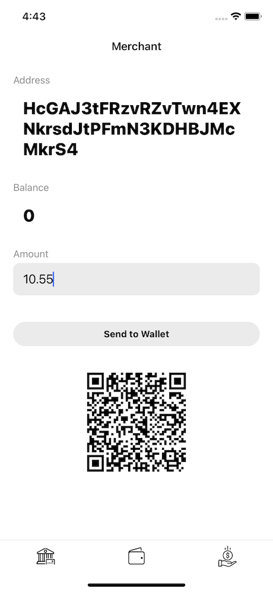

# Solana Savings

POC project for Solana Serum Hackathon by [Attic Lab](https://atticlab.net/), mobile application by [Pragma](https://www.pragma-technologies.com/).

## Description

This project consists of a rudimentary savings contract and a React Native mobile app. They work together to illustrate how [Acorns](https://www.acorns.com/)-like service can be built on Solana blockchain. Basically it works like this:

1. Merchant requests payment, it gets encoded together with recipient address in a QR code (for example, $10.55)
2. Customer scans QR code and transaction for $11 is created, $10.55 goes to the merchant and $.45 to the savings contract
3. Funds on the Savings Contract can be deposited to any DeFi service (like Token Swap or Lending) and earn from fees on those services, so customer basically invests the change from everyday payments

## Setting up Demo

### Requirements

* Rust https://rustup.rs/
* Solana CLI Tools https://docs.solana.com/cli/install-solana-cli-tools
* SPL Token CLI https://spl.solana.com/token
* Yarn https://yarnpkg.com/
* XCode or Android Studio to build and launch the mobile app

### Deploy Savings Contract (optional)

You can skip this step and instead use a Savings Contract published on Devnet at `CR8CRris6RDN8RHw4ANgt7rPTs771kGSu4vNgk76WGJ2`.

```
cd savings-contract/program && cargo build-bpf
```

Once build finishes you can deploy the contract by running:

```
solana program deploy ./target/deploy/savings_contract.so
```

Use `program_id` from the output and update it in `savings-contract/program/src/lib.rs` and `mobile/src/crypto/utils/constants.ts` (value `CONTRACT_PROGRAM_ID`).

### Create Mint

```
spl-token create-token
```

This will create a new token Mint, put it into `mobile/src/crypto/utils/constants.ts` (value `SAVINGS_MINT`).

### Create Savings Pool

```
cd savings-contract/cli
cargo run create-pool <MINT_ADDRESS>
```

Use Mint from the previous step. Set the resulting pool address into `mobile/src/crypto/utils/constants.ts` (value `POOL_ACCOUNT`).

### Build and run mobile application

```
cd mobile
yarn
cd ios && pod install && cd ..
yarn start
```

`pod install` command only required if you plan to launch the app on iOS. Then:

* iOS: `react-native run-ios`
* Android: `react-native run-android`

Once the app opens and you see the wallet screen, tap on the account name to copy it to the clipboard. Then use `spl-token` to mint some tokens to this address:

```
spl-token mint <MINT_ADDRESS> <AMOUNT> -- <WALLET_ACCOUNT>
```

Once you see balance on the screen try to create a transaction to the Merchant account. Use fractional amounts (like `5.88`) to see it rounded and the change going to the Savings Contract.


