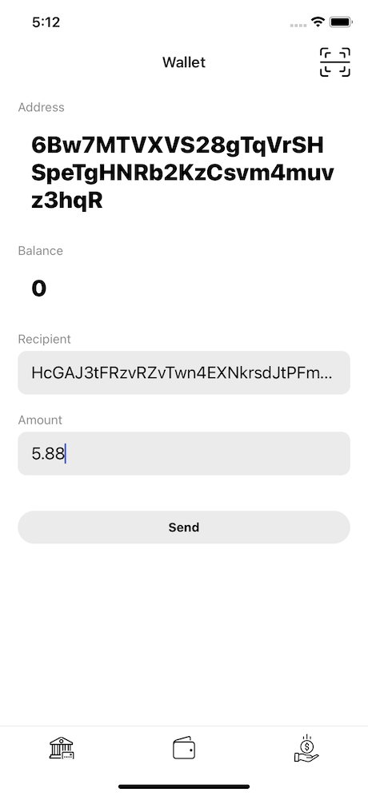
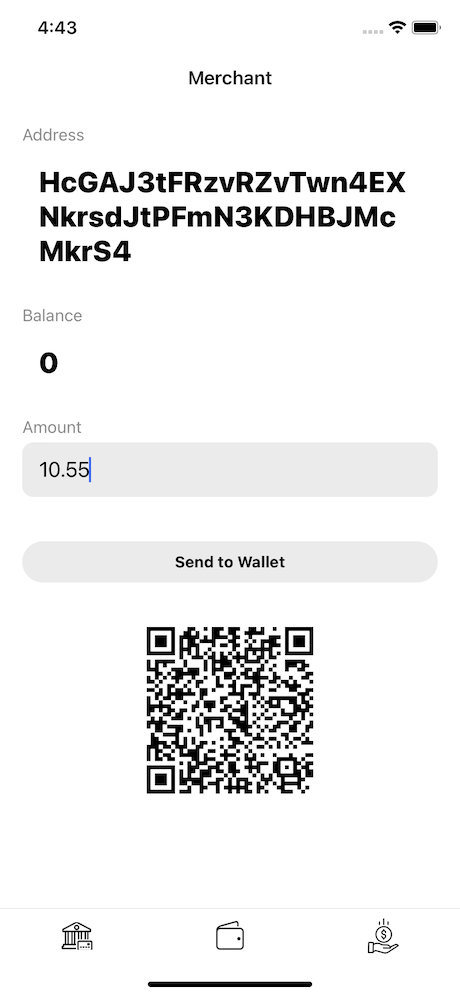

# Solana Savings

POC project for Solana Serum Hackathon by [Attic Lab](https://atticlab.net/), mobile application by [Pragma](https://www.pragma-technologies.com/).

## Background Information

Attic Lab is a fintech blockchain software development company that has experience of working with financial institutions, commercial & central banks (National Bank of Ukraine was one of our customers), and businesses building solutions utilizing DLT.

## Problem

The problem as we see it is two-fold: 

1. Payment systems and business owners need an effective solution which can minimize their expenses and fees paid to external providers without compromising security and efficiency of the process.

2. Developing economies such as Ukraine, for example, have a lack of financial infrastructure for participating in the international trading market, which limits opportunities for local businesses. 

## Solution

Blockchain instruments provide opportunities to jump over legacy banking solutions and use an efficient and liberterian DeFi approach to build modern payment/investment/financial infrastructure.  A robust and efficient payment system working on top of the Solana network and utilizing the SPL token allows performing fast and secure transactions while also tapping into the quickly growing Solana & Serum DeFi ecosystem. 

## Functional Details

Within the hackathon we’ve created a mobile app that enables payments between the customer and the merchant and has an additional feature - savings account. 

The wallet app has the functionality to create and process QR codes thus simplifying the purchase interaction between the two parties. At its core the system relies on the Solana network and SPL smart-contracts.

Savings account works similarly to many banking solutions (roundup, regular transfer) which help you put away some money and make interest on it, however, in this case the savings account funds will be sent to the Solana DeFi apps of the customer choice (stake pool, margin lending, yield farming, etc.)

Here is a sample usage flow for our app:

1. Merchant requests payment, it gets encoded together with recipient address in a QR code (for example, $10.55)
2. Customer scans QR code and transaction for $11 is created, $10.55 goes to the merchant and $.45 to the savings contract
3. Funds on the Savings Contract can be deposited to any DeFi service (like Token Swap or Lending) and earn from fees on those services, so customer basically invests the change from everyday payments

## Setting up Demo

If you do not want to set up all the dependencies and just want to try the app you can download a [pre-built APK](files/solana_savings.apk) with some hard-coded accounts and pre-minted tokens.

### Requirements

* Rust https://rustup.rs/
* Solana CLI Tools https://docs.solana.com/cli/install-solana-cli-tools
* SPL Token CLI https://spl.solana.com/token
* Yarn https://yarnpkg.com/
* XCode or Android Studio to build and launch the mobile app

### Deploy Savings Contract (optional)

You can skip this step and instead use a Savings Contract published on Devnet at `CR8CRris6RDN8RHw4ANgt7rPTs771kGSu4vNgk76WGJ2`.

```
cd savings-contract/program && cargo build-bpf
```

Once build finishes you can deploy the contract by running:

```
solana program deploy ./target/deploy/savings_contract.so
```

Use `program_id` from the output and update it in `savings-contract/program/src/lib.rs` and `mobile/src/crypto/utils/constants.ts` (value `CONTRACT_PROGRAM_ID`).

### Create Mint

```
spl-token create-token
```

This will create a new token Mint, put it into `mobile/src/crypto/utils/constants.ts` (value `SAVINGS_MINT`).

### Create Savings Pool

```
cd savings-contract/cli
cargo run create-pool <MINT_ADDRESS>
```

Use Mint from the previous step. Set the resulting pool address into `mobile/src/crypto/utils/constants.ts` (value `POOL_ACCOUNT`).

### Build and run mobile application

```
cd mobile
yarn
cd ios && pod install && cd ..
yarn start
```

`pod install` command only required if you plan to launch the app on iOS. Then:

* iOS: `react-native run-ios`
* Android: `react-native run-android`

Once the app opens and you see the wallet screen, tap on the account name to copy it to the clipboard. Then use `spl-token` to mint some tokens to this address:

```
spl-token mint <MINT_ADDRESS> <AMOUNT> -- <WALLET_ACCOUNT>
```

Once you see balance on the screen try to create a transaction to the Merchant account. Use fractional amounts (like `5.88`) to see it rounded and the change going to the Savings Contract.


